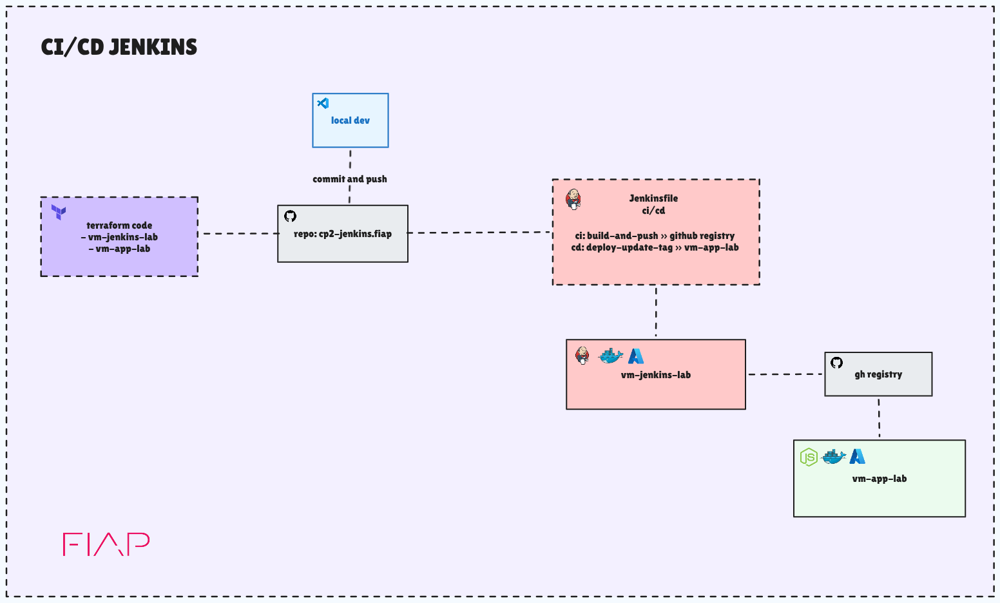

# CP02 - Jenkins CI/CD Pipeline


Checkpoint 02 da disciplina de Computação em Nuvem — FIAP. O projeto implementa uma esteira completa de CI/CD utilizando Jenkins, Docker e infraestrutura provisionada na Azure via Terraform.


## O que foi construido

### Infraestrutura (Terraform + Azure)

- Resource Group unico na regiao `eastus`
- Virtual Network com subnet dedicada ao laboratorio
- Duas Virtual Machines Ubuntu 22.04 (Standard_B2s):
  - `vm-jenkins-lab` — servidor Jenkins rodando em container Docker
  - `vm-app-lab` — servidor de deploy da aplicacao
- Network Security Groups com regras para SSH, HTTP, porta 8080 (Jenkins) e porta 3000 (App)
- IPs publicos estaticos para ambas as VMs
- Chaves SSH individuais por VM

### Pipeline CI/CD (Jenkins)

- **CI - Build:** build da imagem Docker da aplicacao com tag baseada no `BUILD_NUMBER`
- **CI - Push:** push da imagem para o GitHub Container Registry (GHCR)
- **CD - Deploy:** deploy automatico na `vm-app-lab` via SSH, somente na branch `main`
- Trigger automatico via webhook do GitHub a cada push

### Aplicação

- API REST em Node.js com Express
- Endpoint `/` retorna versao, nome da imagem e timestamp
- Endpoint `/health` retorna status da aplicacao
- Containerizada com Docker e publicada no GHCR


## Arquitetura




## Estrutura do Repositorio

```
cp02-jenkins.fiap/
├── Jenkinsfile                  # Definicao da pipeline CI/CD
├── app/                         # Codigo-fonte da aplicacao
│   ├── Dockerfile               # Imagem Docker da aplicacao
│   ├── package.json
│   └── src/
│       └── index.js             # Entrypoint da API Node.js
└── terraform/                   # Infraestrutura como codigo (Azure)
    ├── main.tf                  # Recursos principais (VMs, VNet, NSG)
    ├── variables.tf             # Variaveis de entrada
    ├── outputs.tf               # Outputs (IPs, nomes)
    └── scripts/                 # Scripts de provisionamento das VMs
        ├── install-docker.sh
        └── install-jenkins.sh
```


## Vídeo

> [!NOTE]
> Vídeo de apresentação do projeto, demonstrando a infraestrutura provisionada, a pipeline em execução e o deploy automatizado.

[](https://youtu.be/8zGAl_VttFs)


## Grupo

| Nome | RM |
|
| Anderson Huang | rm565920@fiap.com.br |
| Bruno Henrique | rm566277@fiap.com.br |
| Ronaldo Attamah | rm564630@fiap.com.br |
| Luiz Brito | rm562192@fiap.com.br |
| Guylherme Miguel | rm562374@fiap.com.br |
