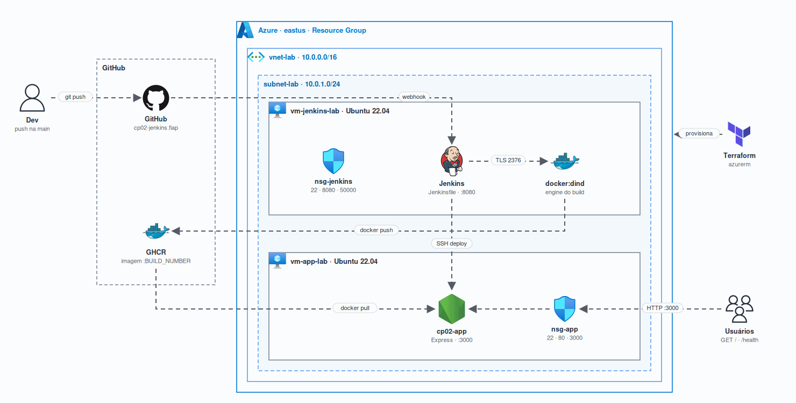

<h1 align="center">
  CP02 - Jenkins CI/CD Pipeline
</h1>

<p align="center">
  <a href="https://youtu.be/8zGAl_VttFs">
    
  </a>
</p>

<h4 align="center"><a href="https://youtu.be/8zGAl_VttFs">Clique para assistir a apresentação no YouTube</a></h4>

<p align="center">
  <a href="https://skillicons.dev">
    
  </a>
</p>

## Qual a finalidade do projeto?

Checkpoint 02 da disciplina DevOps CI/CD. O projeto implementa uma esteira completa  utilizando **Jenkins**, **Docker** e infraestrutura provisionada na **Azure** via **Terraform**, com deploy automatizado de uma API Node.js a cada push na branch `main`.

> [!NOTE]
> A apresentação completa do projeto - incluindo a infraestrutura provisionada, a pipeline em execução e o deploy automatizado - está disponível no [vídeo do YouTube](https://youtu.be/8zGAl_VttFs).


<br>

## O que foi construído

### Infraestrutura (Terraform + Azure)

| Recurso | Descrição |
|---|---|
| Resource Group | Único, provisionado na região `eastus` |
| Virtual Network | VNet com subnet dedicada ao laboratório |
| `vm-jenkins-lab` | VM Ubuntu 22.04 (Standard_B2s) com Jenkins em container Docker |
| `vm-app-lab` | VM Ubuntu 22.04 (Standard_B2s) servidor de deploy da aplicação |
| Network Security Groups | Regras para SSH, HTTP, porta 8080 (Jenkins) e porta 3000 (App) |
| IPs públicos | Estáticos para ambas as VMs |
| Chaves SSH | Pares individuais por VM |

### Pipeline CI/CD (Jenkins)

| Etapa | Descrição |
|---|---|
| **CI - Build** | Build da imagem Docker da aplicação com tag baseada no `BUILD_NUMBER` |
| **CI - Push** | Push da imagem para o GitHub Container Registry (GHCR) |
| **CD - Deploy** | Deploy automático na `vm-app-lab` via SSH, somente na branch `main` |
| **Trigger** | Webhook do GitHub disparando o pipeline a cada push |

### Aplicação

| Item | Descrição |
|---|---|
| Stack | API REST em Node.js com Express |
| Endpoint `/` | Retorna versão, nome da imagem e timestamp |
| Endpoint `/health` | Retorna status da aplicação |
| Distribuição | Containerizada com Docker e publicada no GHCR |


<br>

## Tecnologias utilizadas

- **Jenkins:** servidor de automação para orquestração da pipeline CI/CD;
- **Docker:** containerização da aplicação e do próprio Jenkins;
- **Terraform:** provisionamento da infraestrutura como código na Azure;
- **Azure:** nuvem onde toda a infraestrutura é provisionada;
- **Node.js + Express:** runtime e framework da API exposta pelo pipeline;
- **GitHub Container Registry (GHCR):** registro das imagens Docker geradas;
- **Linux (Ubuntu 22.04):** sistema operacional das VMs;
- **Git:** controle de versão e gatilho dos webhooks de build.


<br>

## Estrutura do repositório

```
cp02-jenkins.fiap/
├── Jenkinsfile                  # Definicao da pipeline CI/CD
├── app/                         # Codigo-fonte da aplicacao
│   ├── Dockerfile               # Imagem Docker da aplicacao
│   ├── package.json
│   └── src/
│       └── index.js             # Entrypoint da API Node.js
└── terraform/                   # Infraestrutura como codigo (Azure)
    ├── main.tf                  # Recursos principais (VMs, VNet, NSG)
    ├── variables.tf             # Variaveis de entrada
    ├── outputs.tf               # Outputs (IPs, nomes)
    └── scripts/                 # Scripts de provisionamento das VMs
        ├── install-docker.sh
        └── install-jenkins.sh
```


<br>

## Grupo

| Nome | RM |
|---|---|
| Anderson Huang | rm565920@fiap.com.br |
| Bruno Henrique | rm566277@fiap.com.br |
| Ronaldo Attamah | rm564630@fiap.com.br |
| Luiz Brito | rm562192@fiap.com.br |
| Guylherme Miguel | rm562374@fiap.com.br |
